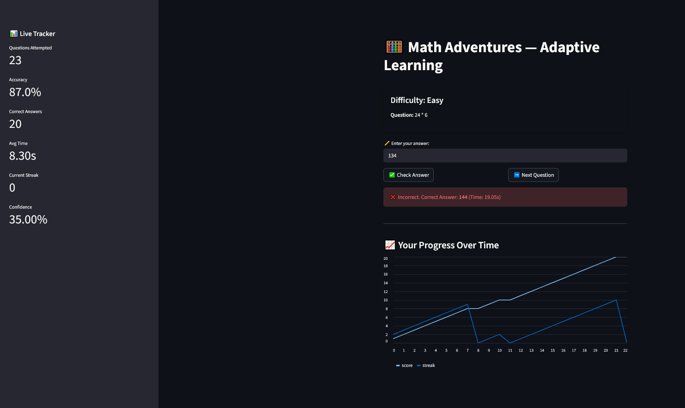
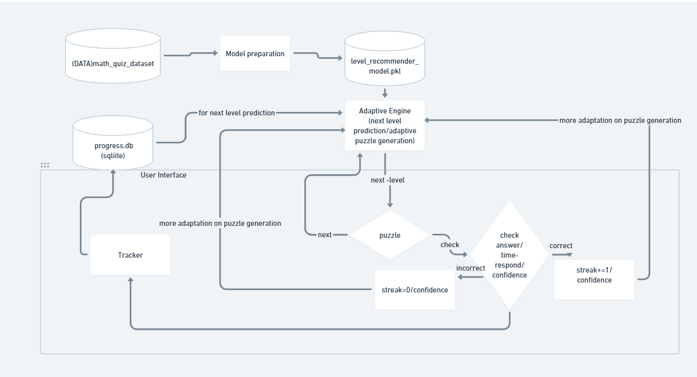

# 🧮 Math Adventures — Adaptive Learning System

Math Adventures is an AI-powered adaptive learning system that dynamically adjusts the difficulty of math questions based on student performance.  
It uses real-time analytics, machine learning, and heuristic rules to deliver a personalized learning experience.

---

## 🚀 Features

- ✅ **Adaptive Question Generation** based on streak + confidence + correctness + response time  
- ✅ **AI-Based Level Recommendation** with trained ML model (`level_recommender_model.pkl`)  
- ✅ **Real-Time Tracking** using SQLite database (`progress.db`)  
- ✅ **Confidence Scoring** using timing + correctness  
- ✅ **Interactive Streamlit UI** showing puzzles and progress  

---

## 🧱 System Architecture Overview

---

## 📊 Data Pipeline

### Training Data Features

- `difficulty`
- `response_time`
- `correct`
- `streak`
- `confidence`
- `next_level` (label)

### Runtime Data Stored in `progress.db`

- correctness  
- response_time  
- updated streak  
- updated confidence  
- current difficulty level  

---

## 🧠 Adaptive Logic

The system uses a hybrid approach:

### 🔹 Machine Learning
Predicts the next difficulty level based on historical performance.

### 🔹 Rule-Based Adjustments

if correct:
streak += 1
else:
streak = 0

Confidence is calculated using:

base = 50
+ correctness impact (±20)
+ streak bonus (up to +40)
+ time impact (−15 to +15)
+ difficulty reward (+3/+6/+9 if correct)
→ Clamped between 0 and 100

Puzzle difficulty adapts based on:

- level  
- streak  
- confidence  

---

## 🧩 Puzzle Generation Logic — Decision Table

The puzzle generation system adapts difficulty using **three control variables**:

- `level` (Easy / Medium / Hard)
- `confidence` (0–100)
- `streak` (0 → increasing)

Puzzle difficulty is determined using the rules in the table below.

---

## ✅ Confidence-Based Overrides

| Confidence Range | Effect on Puzzle | Allowed Operations | Number Range | Notes |
|------------------|------------------|--------------------|--------------|-------|
| ≥ 80 (High)      | Increase Puzzle Difficulty | Easy → `+,-,*` ; Medium/Hard → all ops | Larger ranges per level | Push student upward faster |
| ≤ 50 (Low)       | Reduce Puzzle Difficulty | Easy → `+,-` ; Medium/Hard → `+,-,*` | Smaller number ranges | Helps struggling students recover |
| 50–80 (Normal)   | Use streak logic | Depends on streak | Depends on level | Balanced progression |

---

## ✅ Easy Level Logic

| Condition | Operations Used | Number Range (num1, num2) | Behaviour |
|----------|------------------|----------------------------|-----------|
| Confidence ≥ 80 | `+,-,*` | 10–25, 5–15 | Confidence boost → harder Easy |
| Confidence ≤ 50 | `+,-` | 1–12, 1–10 | Easier Easy |
| Streak ≤ 5 | `+,-` | 1–15, 1–10 | Beginner Easy |
| 6 ≤ Streak ≤ 8 | `+,-` | 10–30, 5–15 | Moderate Easy |
| Streak > 8 | `*,/` | 5–20, 2–10 | Advanced Easy |

---

## ✅ Medium Level Logic

| Condition | Operations Used | Number Range (num1, num2) | Behaviour |
|----------|------------------|----------------------------|-----------|
| Confidence ≥ 80 | All (`+,-,*,/`) | 30–70, 10–30 | Medium becomes Hard-like |
| Confidence ≤ 50 | `+,-,*` | 10–40, 5–20 | Easier Medium |
| Streak ≤ 5 | `+,-,*` | 10–40, 5–20 | Entry Medium |
| 6–10 Streak | `+,-,*,/` | 20–60, 5–25 | Balanced Medium |
| Streak > 10 | `+,-,*,/` | 30–80, 10–30 | Hard-level Medium |

---

## ✅ Hard Level Logic

| Condition | Operations Used | Number Range (num1, num2) | Behaviour |
|----------|------------------|----------------------------|-----------|
| Confidence ≥ 80 | All (`+,-,*,/`) | 80–200, 10–40 | Ultra Hard |
| Confidence ≤ 50 | `+,-,*` | 20–80, 5–25 | Easier Hard |
| Streak ≤ 5 | All ops | 20–80, 5–25 | Entry Hard |
| 6–10 Streak | All ops | 50–120, 10–30 | Intermediate Hard |
| Streak > 10 | All ops | 80–200, 10–40 | Expert Hard |

---

## ✅ Clean Division Logic

| Operation | Rule Applied | Result |
|-----------|--------------|---------|
| `/` | `num1 = num2 * random.randint(1, 9)` | Guarantees clean division, avoids decimals/zero |
| others | normal arithmetic | uses `eval()` safely |

---

## ✅ Expected Time Calculation

| Operation | Base Time (seconds) |
|-----------|-----------------------|
| `+`       | 5s |
| `-`       | 6s |
| `*`       | 8s |
| `/`       | 10s |

Formula:

expected_time = base_time + (difficulty - 1) * 1.5

Difficulty Mapping
Easy = 1
Medium = 2
Hard = 3

---

## ✅ Summary

- ✅ Confidence adjusts puzzle difficulty instantly  
- ✅ Streak adjusts gradual difficulty  
- ✅ Division guaranteed clean  
- ✅ Expected time adjusts based on operation + level  
- ✅ All logic is adaptive and user-specific  

---

